# iBank — Hanover Document Management Platform

> An internal document management system for Hanover Insurance Group professionals. Manage, review, and collaborate on policy documents with role-scoped access, automated deadline reminders, and full-text search powered by OCR.

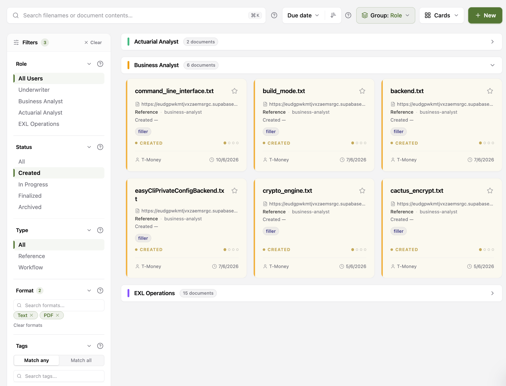

---

## Table of Contents

- [Features](#features)
- [Tech Stack](#tech-stack)
- [Architecture](#architecture)
- [Getting Started](#getting-started)
- [User Roles](#user-roles)
- [Screenshots](#screenshots)
- [Deployment](#deployment)

---

## Features

### Content Library
- Searchable, filterable document library scoped by role
- Full document lifecycle: **Created → In Progress → Finalized → Archived**
- Checkout / check-in workflow to prevent concurrent edits
- Expiration and next-review-date tracking
- OCR text extraction — search inside document contents, not just filenames
- Tag-based organization with global tag management (admin)
- Favorites for quick access

### Activity & Notifications
- Per-user activity feed of document changes and ownership transfers
- Review/expiry reminders with urgency tiers (this week, coming up, overdue)
- Admin-authored announcements with role targeting and expiry
- Calendar view of upcoming review dates and expirations
- Per-user read, pin, and delete state on every notification

### Admin Dashboard
- Overview: total employees, content counts, status breakdown, top roles by content
- Metrics tab: API request volume, error rate, document activity, top active users
- Reports: transactions, content currency, and expiration/review dates by owner and role
- Tag management inline in the dashboard

### User & Access Management
- Admin-only user management — create, edit, assign portal and role
- Role-based content filtering (employees only see content for their position)
- Employee directory with profile photos linked to owned content

---

## Tech Stack

| Layer | Technology |
|---|---|
| Frontend | React 19, Vite 6, React Router 7, TanStack Query v5, Zustand, Tailwind CSS v4 |
| API | Node.js, tRPC v11 (standalone HTTP server) |
| Database | PostgreSQL via Supabase, Prisma ORM v7 |
| Auth | Supabase Auth (JWT Bearer token) |
| Monorepo | pnpm workspaces, Turborepo |
| Linting | Biome |
| Testing | Vitest |
| Language | TypeScript 5.8 throughout |

---

## Architecture

```
apps/
  web/      React SPA — pages, components, tRPC client
  api/      tRPC standalone server — routers, Prisma, Supabase auth context
  admin/    Separate admin React app (under development)
packages/
  types/    Zod schemas + shared TypeScript types
  ui/       Shared component library (TopNav, inputs, file upload)
  utils/    Pure utilities (formatDate, truncate, capitalize)
supabase/   SQL migrations, seed data, Supabase config
```

### Request flow

```
Browser  →  Supabase Auth (JWT)
         →  tRPC httpBatchLink (Bearer token in header)
         →  API context resolves token → UserProfile (10 s in-memory cache)
         →  protectedProcedure / adminPortalProcedure guard
         →  Prisma → PostgreSQL (Supabase)
```

All API types flow back to the frontend through a single `AppRouter` export — no manual type duplication.

---

## Getting Started

### Prerequisites

- Node.js ≥ 22
- pnpm ≥ 10
- Docker (for local Supabase)
- [Supabase CLI](https://supabase.com/docs/guides/cli)

### 1. Install dependencies

```bash
pnpm install
```

### 2. Configure environment

```bash
cp .env.example .env
```

Edit `.env` with your Supabase keys. For local development the defaults in `.env.example` work once the local Supabase stack is running.

### 3. Start the local database

```bash
pnpm db:start      # starts Supabase (Docker)
pnpm db:reset      # applies all migrations and seeds base data
pnpm db:seed:demo  # loads rich demo data and demo user accounts
```

Demo credentials after seeding:

| Account | Email | Password |
|---|---|---|
| Admin | `admin@hanover.test` | `HanoverTest123!` |
| Employee | `user@hanover.test` | `HanoverTest123!` |

### 4. Run in development

```bash
pnpm dev
```

- Web app: [http://localhost:5173](http://localhost:5173)
- API server: [http://localhost:3000](http://localhost:3000)

---

## Common Commands

```bash
pnpm build            # production build (all apps)
pnpm lint             # check with Biome
pnpm lint:fix         # auto-fix lint issues
pnpm format           # format all files
pnpm typecheck        # TypeScript type check (all packages)
pnpm test             # run all tests
pnpm test:watch       # watch mode

# Run tests for a specific package
pnpm --filter @myapp/web test
pnpm --filter @myapp/api test

# Database helpers
pnpm db:stop                            # stop local Supabase
pnpm db:gen-types                       # regenerate DB types from local schema
pnpm --filter @myapp/api db:studio      # open Prisma Studio
pnpm --filter @myapp/api db:migrate     # run Prisma migrate dev (local)
```

> **Production migrations** must go through `supabase db push` using the SQL files in `supabase/migrations/`. Do not run `prisma db push` against the production Supabase instance — it conflicts with the Supabase Auth schema.

---

## User Roles

iBank has two **portals** and five **roles**:

| Portal | Role | Access |
|---|---|---|
| `admin` | `admin` | Full access — users, tags, announcements, metrics, all content |
| `employee` | `underwriter` | Content filtered to underwriter job position |
| `employee` | `business-analyst` | Content filtered to business analyst job position |
| `employee` | `actuarial-analyst` | Content filtered to actuarial analyst job position |
| `employee` | `exl-operations` | Content filtered to EXL operations job position |

Content records carry a `job_position` field. Employees only see content matching their role (plus content with no position restriction). Admins see everything.

---

## Screenshots

### Sign In

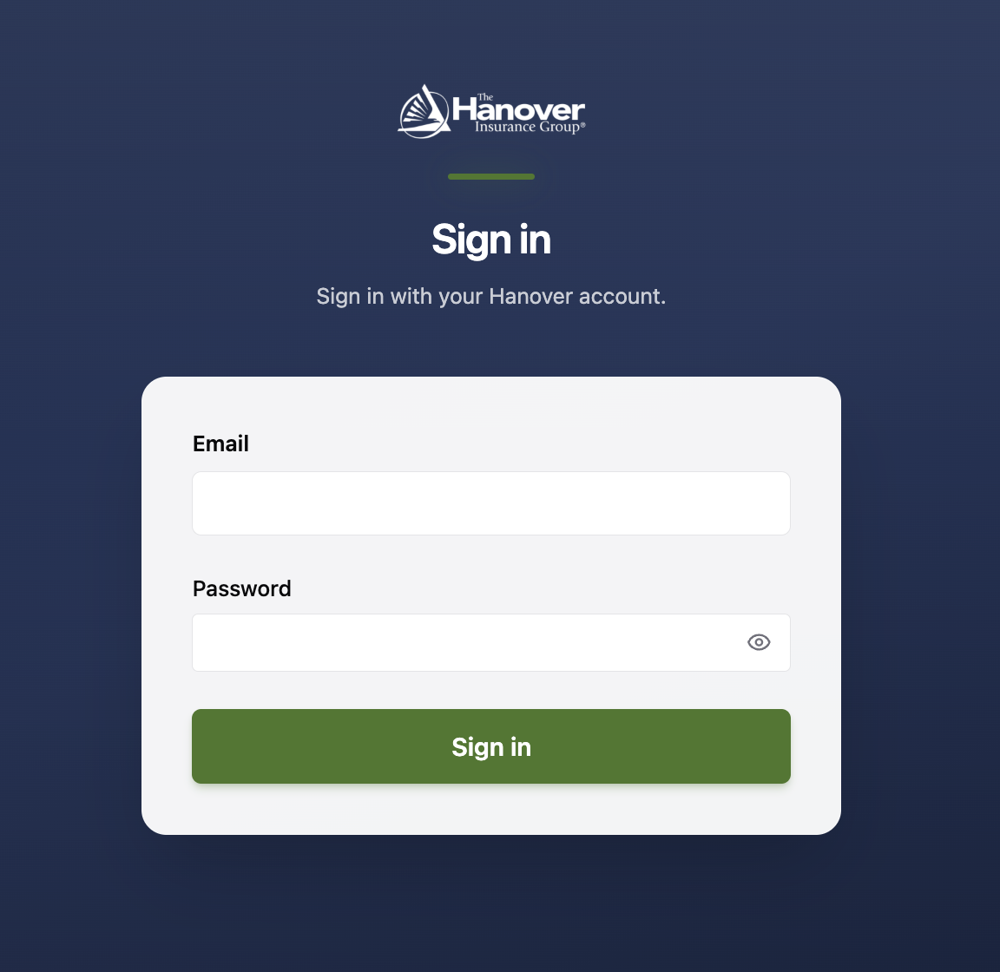

---

### Content Library

Browse and filter documents by role, status, type, format, and tags. Results are grouped by job position.


#### Full-Text Search (OCR)

Search inside document contents — not just filenames. OCR text extraction runs automatically on upload.

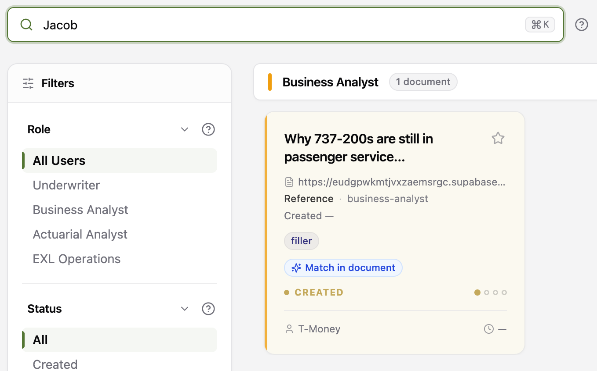

#### Document Detail

View and edit document metadata, ownership, lifecycle status, dates, and tags.

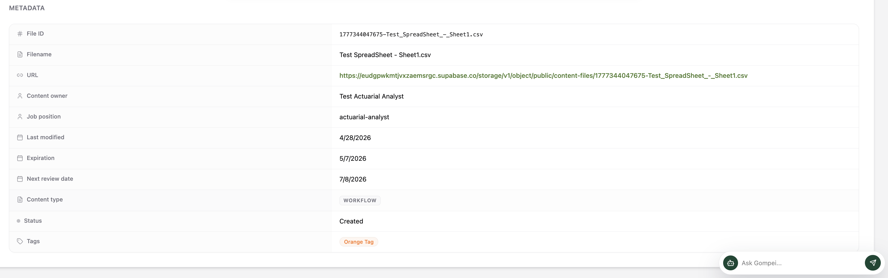

---

### Dashboard

#### Overview

At-a-glance content health: total employees, total content, finalized count, in-progress count, content-by-status donut, and top roles by content volume.

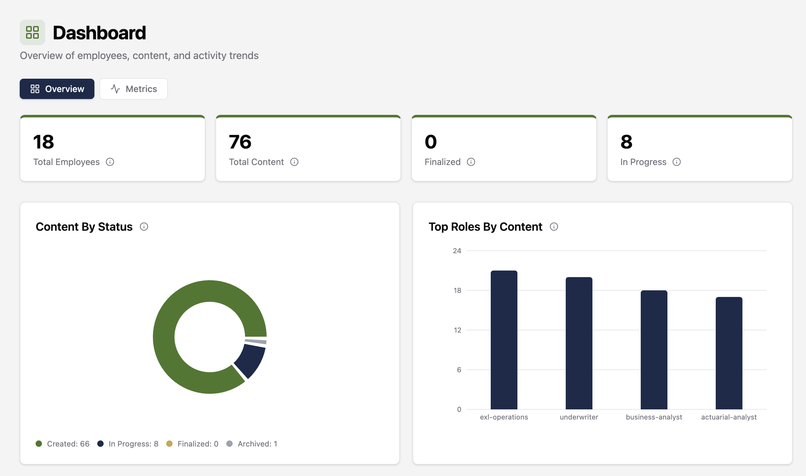

#### Metrics

System-level metrics: API request volume, error rate, active users, document activity by action type, and top active users.

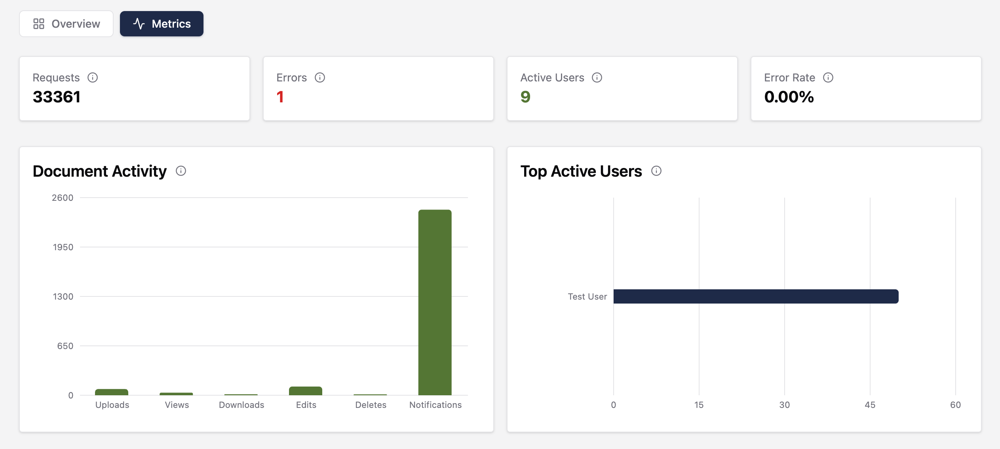

#### Reports

Detailed breakdowns: transactions by owner and role, content currency, and expiration/review dates with urgency highlighting.

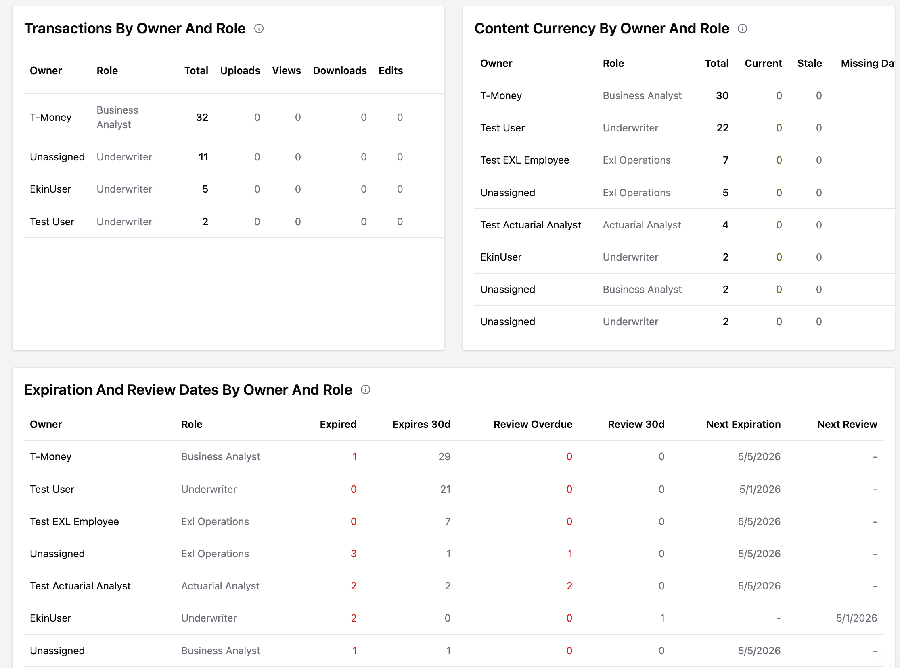

---

### Activity Feed

Track document changes and ownership transfers. Click any item to see the detail and open the related document.

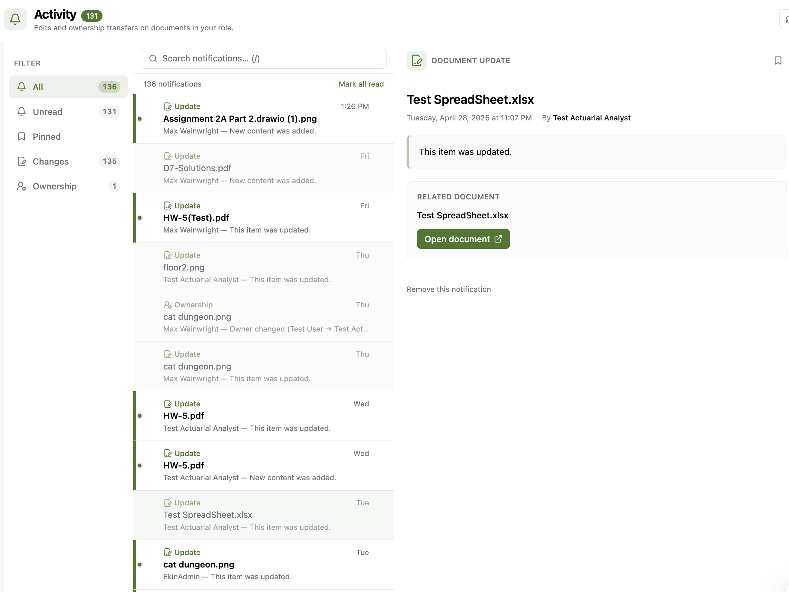

---

### Notifications

Review/expiry reminders sorted by urgency — overdue, this week, and upcoming. Filter by unread, pinned, announcements, or ownership events.

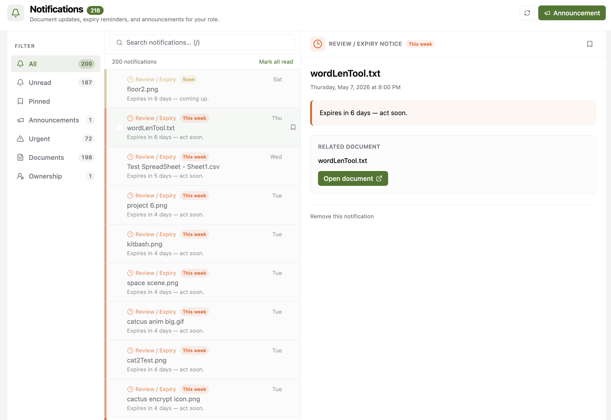

---

### Calendar

Month view of upcoming review dates and expirations across your content. Toggle between your own content and all role-scoped content.

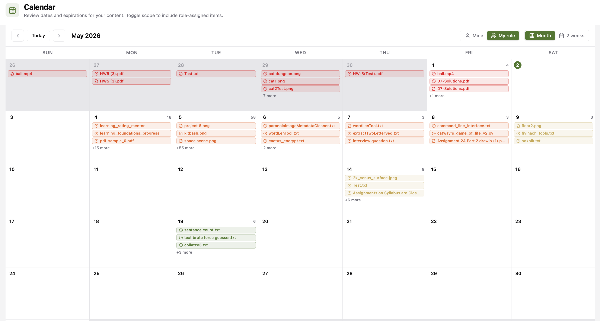

---

### User Management *(Admin only)*

Create and manage user accounts, assign roles and portals, and set employee codes and profile photos.

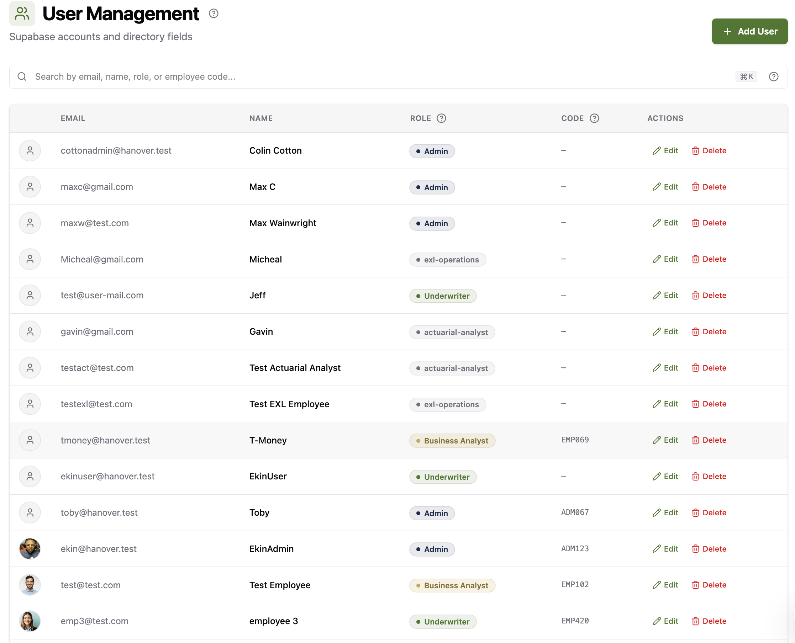

---

## Deployment

The production web app is hosted on Railway:

**Web:** https://myappweb-production-56ad.up.railway.app

Environment variables required for production match `.env.example`. Set `VITE_API_URL` to your deployed API URL and `CORS_ORIGINS` to the web app's origin on the API service.
